* We are human beings, therefore, both sorrow and joy ought to be there. the fact is you have to learn how to control it, move on, shine others instead of being illuminated by others.   

  To be the person who can shine others as the sun shines in the universe is what should be followed.

  To live is to find the truth, which is to be a good entity. 

  That's simple, we are chasing our final destiny that is to be someone - a good man. 

  The question is how can we find a reasonable definition of being a good man. 

  It is perplexed sometimes since the context differs.

  我们是人，所以悲伤和快乐都应该在那里。 事实是你必须学会如何控制它，继续前进，照亮别人，而不是被别人照亮。

  做一个能像太阳照耀宇宙一样照耀别人的人，才是应该遵循的。Bruce lee once said, "Martial arts is the way of expressing the arts of human body"; And to my mind, "Writing is the path to observe one's mind and spirit"

  活着就是要找到真相，就是做一个好人。

  这很简单，我们正在追逐我们最终的命运，那就是成为某个人——一个好人。

  问题是我们如何才能找到一个合理的解释来定义一个好人。

  由于所处环境的不同，有时会感到困惑。

* To live is to grow, without learning and creating, everything is boring. 

  活着就是成长，没有学习和创造，一切都是枯燥乏味的。

* First, it is rather crucial to point out, the primary goal is to maintain a healthy body while reducing body weight, therefore, sufficient nutrition must be taken place, in other words, one ought to eat regularly instead of cutting down the amount of food that he or she used to take. The tricky part is to filter out high calories while absorbing the fiber-rich food. 

  Second, self-discipline, one of the most important aspects. One must start exercising and make it into a daily habit. Take, for example, beginning with 1-mile jogging, and then 2 miles, 3 miles, gradually increasing the # of miles. Do not rush, do not hesitate.

  Third, but not the last, keep listening to motivational speeches, reading tons of books, in order to help you run through all the difficulties. 

  There are many more items in the toolkit of weight loss, these are the 3 majors I have been practicing this far. Remember, people and things in the past can be remembered, but please don't look back.

  首先需要指出的是，减肥的首要目标是保持健康的体魄，因此，一定要做到营养充足，也就是说，应该规律饮食，而不是减少食物的摄入量。 棘手的部分是在吸收富含纤维的食物的同时过滤掉高热量。

  第二，自律，最重要的方面之一。 一个人必须开始锻炼并使其成为一种日常习惯。 例如，从 1 英里慢跑开始，然后是 2 英里、3 英里，逐渐增加英里数。 不要着急，不要犹豫。

  第三，但不是最后，继续听励志演讲，阅读大量书籍，以帮助您度过所有困难。

  减肥工具集里包含的内容还有很多， 这三个方面是目前主要的练习。 记住，过去的人和事可以记住，但请不要回头。

* One of my friends told me: "One must be conscious of the decision of life. " 

  "The paradox is we will grow only after those mistakes which form the integrity of all lives."

  Please moving forward !!! 😇

  我的一位朋友告诉我：“一个人必须时刻觉察自己的人生决定。”

  “矛盾的是，只有在经历那些构成所有生命完整性的错误之后，我们才会成长。”

  请保持前进！！！😇

* One lives with a true peaceful mindset inside would never seek happiness from outside, which is ironic for those who are looking for a calm moment and harmony by extra activities - listening, learning, and sometimes physical training, because the pleasure, joyfulness, delight is already there.

  内心真正拥有平静的人永远不会从外部寻求幸福，这对于那些通过额外的活动（聆听、学习，有时甚至是体育锻炼）寻求平静与和谐的人来说具有讽刺意味。

  It is a little bit contradicting for things that we used to understand, the fact is, we are, living under the same dome which is full of collisions. 

  对于我们过去所理解的概念来说有点矛盾，事实是，我们生活在同一个充满碰撞的穹顶之下。

​       

* Living to us is piano-playing do to the player, we strike the keys passionately for miscellaneous music genres. The fact is, one must keep playing until the fingers fall off before taking a bow.

  生活对我们来说就像钢琴演奏对演奏者一样，我们为各种音乐流派热情地敲击琴键。 事实是，在谢幕之前，必须一直弹奏直到手指脱落。

  

* "Adding pages for your notebook, there will be no new content otherwise."

  “为你的笔记本添加新页，否则将没有新的内容。”

  

* "It may be important to great thinkers to examine the world, and despise it.
  But I think it is only important to love the world, not to despise it, not for us to hate each other, but to be able to regard the world and ourselves and all beings with love, admiration, and respect. "

  对伟大的思想家来说，如何审视这个世界似乎是重要的事情。
  但我认为，重要的是爱这个世界，而不是去讨厌它，非互相憎恨，而是能够以爱、钦佩之情和尊重来看待这个世界，我们自己以及所有芸芸众生。

  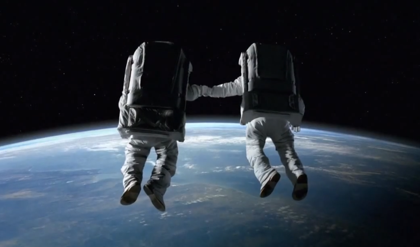

  

* "Words do not express thoughts very well because of their essence of cunningness, they always become a little different immediately after they are conveyed. A little distorted, a little foolish."

  “文字因为狡猾的本质而不能很好地表达思想，总是在传达后立即变得有点不同。有点扭曲，有点愚蠢。”

  

* "It is hard to tell the exact feeling when cold and warm collide as in the person who crosses the hands in the winter."
  "当寒冷和温暖碰撞时，就像冬天交叉双手的人一样，很难说出确切的感觉。"

  

* "I believe that I am not responsible for the meaningfulness or meaninglessness of life. But that I am responsible for what I do with the life I've got. "

  "我认为对于生活是否有意义我并不负有什么责任，但是对于我自己拥有的却是这样的。"

  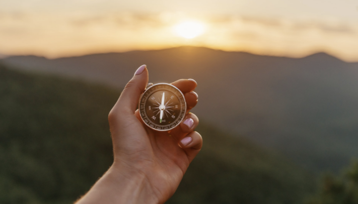

* "One must know the characteristics of a person are shaped by the environment and the way he or she grows, Bruce Lee was there by chance, no one else will be the exact same as him once again on Earth. Lee was curious, diligent , and lucky,  he had tutors, mentors from different backgrounds, especially Jiddu Krishnamurti, who was one of the greatest spirits on Earth as well."
  "要知道一个人的性格是由环境和成长方式塑造的，李小龙的出现是偶然的，地球上再也没有人能和他一模一样了。 李好奇、勤奋、幸运，他曾师从自不同背景的导师，尤其是吉杜克里希那穆提，他也曾是地球上最伟大的精神之一。"

  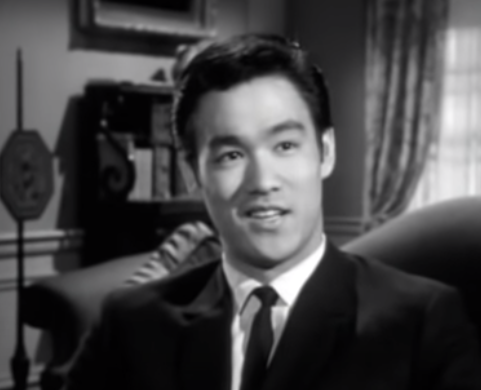

* 遥遥江上，跑者无双，天下之大，唯我独尊！

  "Through the foggy cloud, where the photon lies, energy shines upon you; I knew God is being with me, he likes me, he spreads his love, hence success is right ahead."
  "穿过雾云，光子所在的地方，能量照耀着你； 我知道上帝与我同在，他喜欢我，他传播他的爱，因此成功就在前方。"

  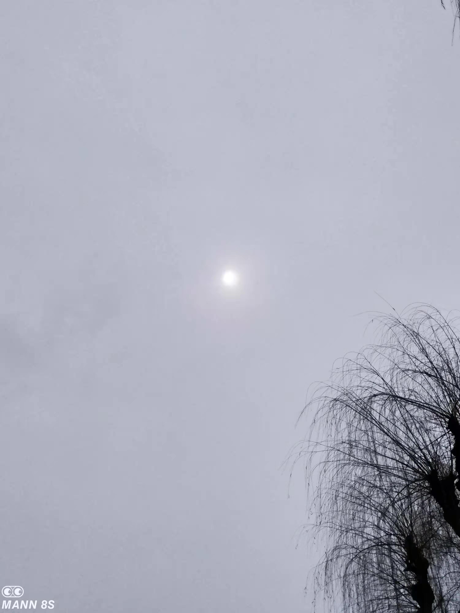

* "Even though I don't have any kind of beliefs, Buddha and God always within me. 
  Paradox, isn't it?"

  "即使我没有任何信仰，佛陀和上帝总是在我心中。
  悖论，不是吗？"

  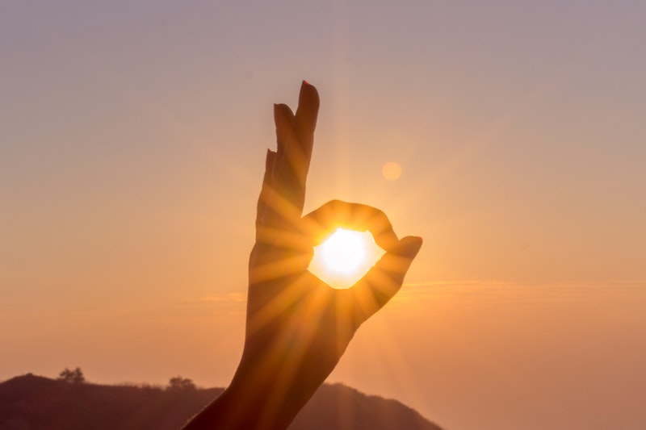

* Melodies, songs, there exist a great many, people always didn't comprehend the connotation; 
  Recollection, nostalgia, intertwining with convoluted emotions, they start to realize the implication;
  Past, now, and future, the entity of the timeline, yet it is not straight, rather Gaussian. People observe us through a "cdf", whereas the "pdf" is where the truth lies. "

  旋律、歌曲，有很多，人们总是不明白其中的内涵；
  追忆、怀旧，交织着错综复杂的情绪，开始领悟其中的寓意；
  过去、现在和未来，时间线的实体，但它不是直的，而是高斯的。 人们通过“累积分布函数”观察我们，而“概率密度函数”是真相所在。 "

  > ## cdf - Cumulative Distributed Function   $Integral$
  >
  > ## pdf - Probability Density Function         $Derivative$
  >
  > **People often observe us through the outcome or a cumulative outline, the figure, the image.**
  >
  > **But the truth is at the current moment, which the derivative stands for. **
  >
  > **This is called "philosophy + Math"**
  >
  > __Fantastic, isn't it?__
  > __Life is simply formed with all those entities.__ 

* "Life is tough and may not always come to you with good fortune, hence, no matter what is going to happen, as long as you hold this ( TVP - The Venus Project ) in yourself, your mind, there is still hope. "

  "The essence is we need a larger version of love, capital 'L' instead of 'l'. "

  " 'L' for all mankind, 'l' for certain tribes."

  “生活会很艰难，不一定总会有好运临到你，因此，无论发生什么，只要你心怀（TVP-维纳斯计划），就一定是有希望的。”

  “从本质上来说我们需要更大版本的爱，大写'L'而不是'l'。”

  “‘L’代表全人类，‘l’代表某些部落。”

  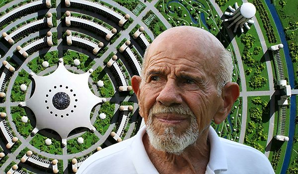

* "With hope, you are truly alive; Without hoping, life will turn ash, especially when you are in a crappy situation."

  “怀着希望，你才真正活着； 没有希望，生活就会化为灰烬，尤其是当你处于糟糕的境地时。” 

  

* "No one could defeat himself truthfully unless he is being not aware of  such existence any longer."

  "除非他不再意识到那个存在的自己，否则任何人都无法诚实地打败自己。"

  

* "Time and Space are the frameworks within which the mind is constrained to construct its experience of reality.	"

  "时间和空间形成了构建现实体验，进而导致思想被限制于其中的框架。”

  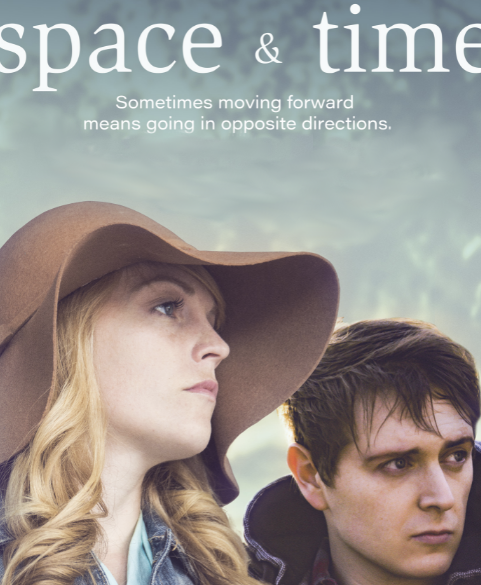

* The world is full of unpredictability, and it is a set of elements which we call life.
  Some say, "Oh my life is unfair!", and my understanding is, "The fairness is successful combination of fairness, and unfairness!"

  世界充满了不可预测性，它是我们称之为生命的的元素集合。
  有人说，“哦，我的生活是不公平的！”，但我的理解是，“公平是公平和不公平的成功结合！”

  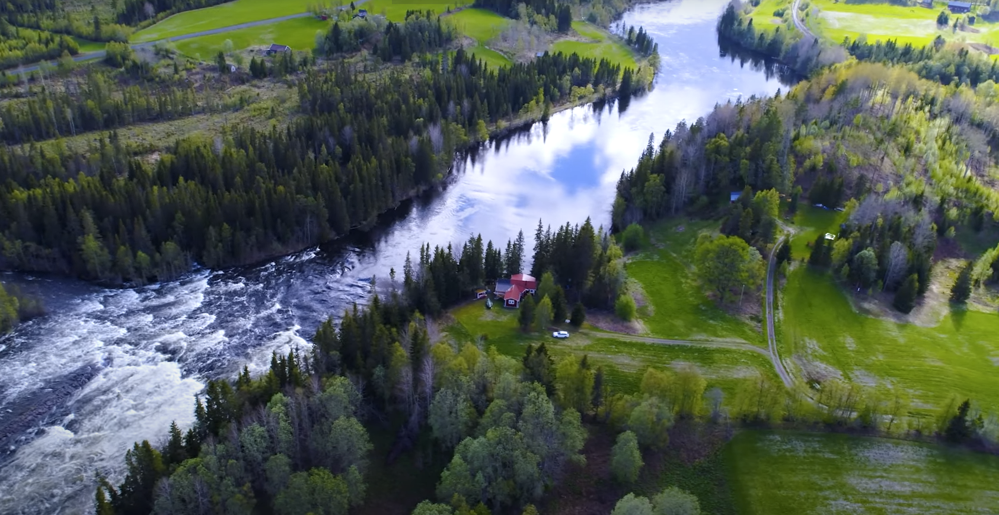

* "Never take life too seriously. It's a mere dance, enjoy the melody instead of worrying about what note is coming next which would cause one to miss the real meaningfulness of his journey."

  "对待生活切勿过于严肃。 它仅仅是一支舞蹈，享受旋律而不要担心接下来会出现什么音符，这会导致一个人错过他旅程的真正意义。”

  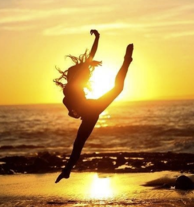

* "When I was young, I used to admire intelligent people; As I grow older, I admire kind people. "

  “True Gorgeous men often walk on the street with ordinary faces, good hearts, and peaceful minds.”

  “小时候，我崇拜聪明的人；长大后，我崇拜善良的人。”

  “真正的美男子走在大街上，往往拥有平凡的面容，善良，和平静的内心。”

  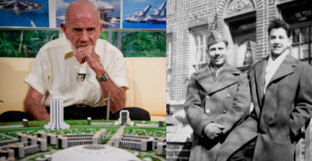

* “The object of life is not to be on the side of the majority, but to escape finding oneself in the ranks of the insane.”
  “生活的目的不是站在大多数人的一边，而是躲避使自己陷入疯狂的行列。”

  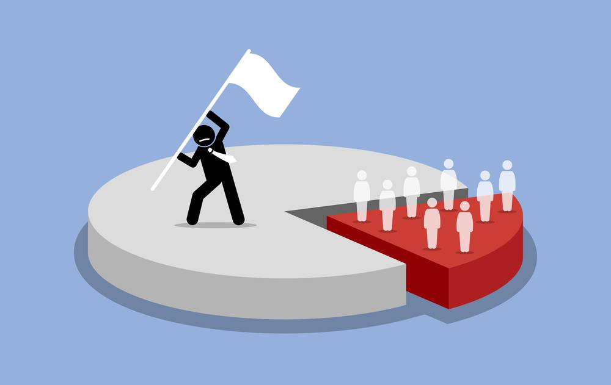

* "Pain and suffering are always inevitable for a large intelligence and a deep heart. The really great men must, I think, have great sadness on earth."

  "痛苦和磨难对于一个大智慧和一个深沉的心来说总是不可避免的。 我认为，真正伟大的人在世上一定同时承受很大的悲伤。"

  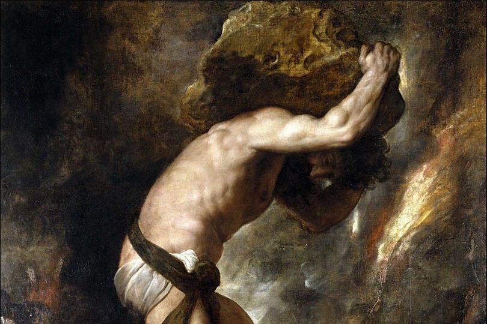

* My new idea: People say, "It is hard to be a good man, but easier to be in a certain type of indulgence", I have translated to another version, I flip it upside down. I would say, "It is rather a simple task to achieve a good person, due to the fact that one does not need too much effort to reach it, you may not rich, but at least you can manipulate the attitude to others, the relationship is under your control; On the other side, to approach an evil mind is of course very easy thing, but it is somewhat anti-human, we are human beings :) "

  我的新想法：人们总说，“做一个好人很难，某种形式的放纵似乎更容易”，我已经翻译成另一个版本，我把它颠倒过来了。 我会说：“成为一个好人是一件相当简单的事，因为一个人不需要太多的努力便可以达到，你可能并不富有，但至少你可以选择与别人相处的态度， 一切在你的控制之下；另一方面，接近某种邪恶的思想当然是件容易的事情，但它有点反人类啊，我们是人类不是吗:)”

  

* "Helping each other is the nature of all beings, rather than fight against."

  "互助是众生的本性，而不是对抗。"

* "Yesterday is history, tomorrow is mystery, but today is a gift that is why it is called the present."

  "昨日已成历史，明天将是神秘的，但是今天堪称礼物，这就是为什么present是这样翻译的。"

  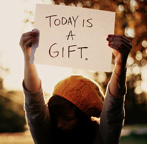

* "Bruce lee once said, "Martial arts is the way of expressing the arts of human body"; And to my mind, "Writing is the path to observe one's mind and spirit 😇, it is the way of thinking through pen, and paper"

  "李小龙曾说过，“武术是人体艺术的表现方式”； 而在我看来，“写作亦是观察一个人的思想和精神的途径😇，它是用纸、笔来思索的方法”

  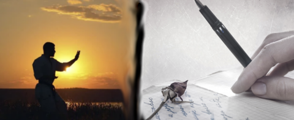

* "Life is comprised of each small achievement in everyday lives as in the area of a circle is formed by each piece of rectangle slice(Calculus); One will find the truth of life and its relation to mathematics only after the grasp of a deep understanding of both and observe it as a whole. "

  "生活是由每天的一个个小成就组成的，就像圆形的面积是由每一块矩形切片（微积分）组成的； 只有对两者都有深刻的理解，并从整体上进行观察，才能找到生命的真相及其与数学的关系。"

  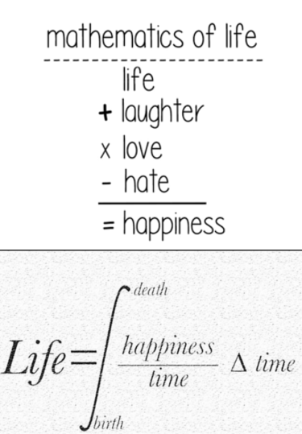
  
  
  
* "Once you hit a certain age you become permanently unimpressed by a lot of shit."

  "一旦你到了某个年龄段，你将对许多曾经的趣事永远都不再感兴趣。"

  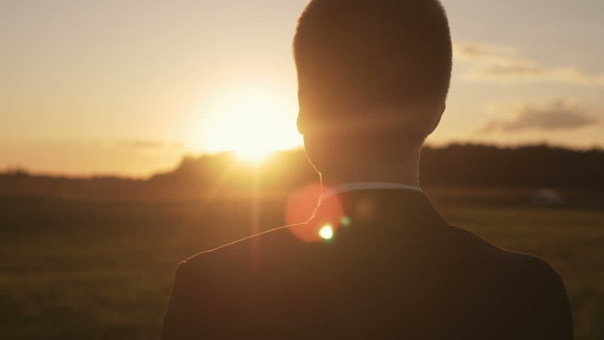

  

* What one could do yesterday, does not mean a second chance in another day, one must do whatever could be done when youth; What one has today does not mean you shall own it in the next day, one ought to be living in the present; What has not happened yet, does not mean it is not going to occur in the future; so therefore, we behoove to  seize the time, grasp the moment, store resources, and polish the skills, ready for whatever may come, when things are coming, one will act rapidly, and appropriately without redundancy, which it often comes from over thinking.

  “A good martial artist does not become tense, but ready. Not thinking, yet not dreaming. Ready for whatever may come. When the opponent expands, I contract; and when he contracts, I expand. And when there is an opportunity, “I” do not hit, “it” hits all by itself.”  --Bruce Lee

  

  “昨天能做的，不代表日后有第二次机会，年轻时能做的就必须去做； 一个人今天拥有的，不代表第二天就拥有它，一个人应该活在当下； 还没有发生的事情，不代表以后不会发生； 所以，我们应该抓紧时间，把握时机，资源储备，磨练本领，做好万全之策，当有事情发生之际，行动迅速，得体，不拖泥带水，这往往来自于过度思考。“　 - 宣雄民

  “一个好的武者不会让自己变得紧张，而是时刻都准备好了。 没有过度思索，也没有做白日做梦。 为可能发生的一切做好准备。 对手前进，我退守； 当他退守时，我便前进。 当有机会时，“我”不打，“它”自己打（拳）。”　- 李小龙

​		

* "I think of learning to cook is equivalent of learning to program in some extent. First, you need to recognize the ingredients which is corresponding to the fundamental of coding, such as variables, statement structure, etc.; Then, you observe how others do beforehand, it points to the mimicking of coding from other programmers; After that, it is time to get your hands dirty, the initial experiences will yield real trouble for you, just like the newbie programmer would make unexpected errors which sometimes is weird, or disasters for your computer system; And lastly, as you maintain a regular practicing of such, you move toward a real experienced cook eventually, so is a programmer. "

  "我认为学习烹饪在某种程度上相当于学习编程。 首先，你需要认识素材成分，这正对应了编程中的基础，如变量、语句结构等； 然后，你先观察别人是怎么做的，即模仿其他程序员的编码； 在那之后，是时候动手了，最初的经验会给你带来真正的麻烦，就像新手程序员会犯一些意想不到的错误，有时很奇怪，或者对你的计算机系统造成灾难； 最后，当你保持定期练习时，你最终会成为一名真正有经验的厨师，程序员也是如此。"

  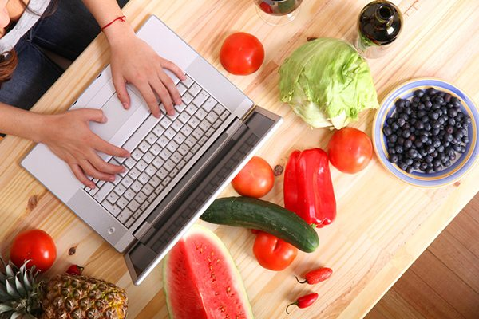

* "There exists a feeling, just bad luck, but you are strong, and positive, which are both disadvantages and advantages. Perplexed as such, isn't it?

  “有一种感觉，只是运气不好，但你很坚强，也很积极，这既是劣势也是优势。就是这样稀里糊涂的，不是吗？

  

* The cliche says, "Gorgeous appearances are alike, yet the interesting souls only found one in thousand. "  For me, it should be,  "spreading the wonderful soul like the virus. Hence, no more similar appearance."

  俗话说，“华丽外表何其相似，有趣灵魂却是千分之一。”　我想它应该是，“如病毒般传播美妙灵魂。因此，外表不再相似。”

  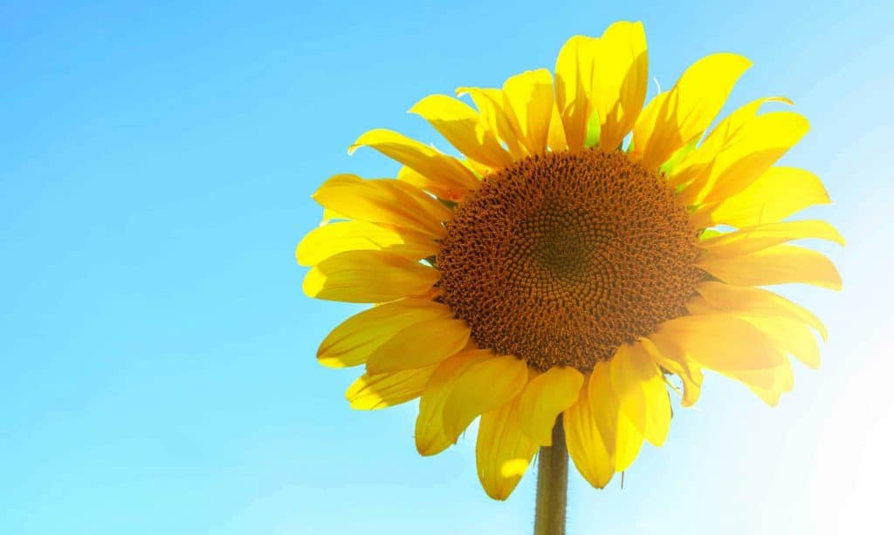

* "The greatest happiness in this world is to have someone, like-minded, knowledgeable, sharing weal and woe, not forgetting the original intention. Every word she says can get your admiration, every look in her eyes is vivid, with such person live together is to live up to brilliant life."  -- Cao Pi

  “这世上最大的幸福，就是有一个人，志同道合，知情识趣，患难与共，不忘初衷。她说的每一句话都能让你钦佩，她的每一个眼神，都栩栩如生，和这样的人一起生活在一起就是不负辉煌的人生。”——曹丕
  
  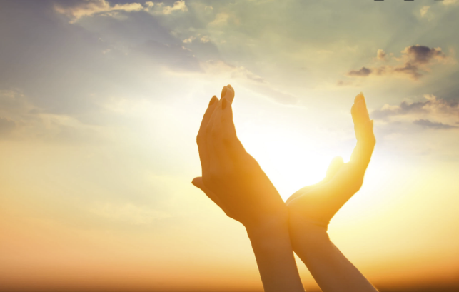

